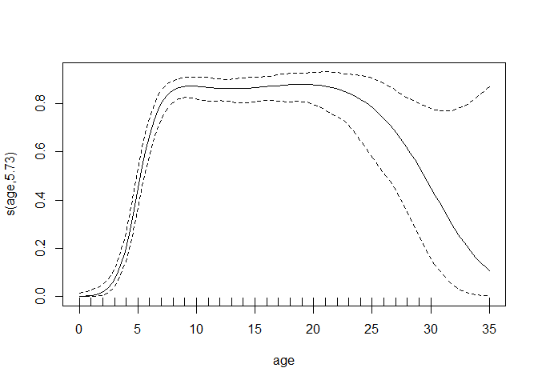

Effect of hunting and by-catches on the observed rate of growth of the
Baltic sea grey seal population
================

This repository contains code and data for reproducing the results in
Report X:2021, Department of Environmental Research and Monitoring,
Swedish Museum of Natural History.

## Data

The report utilises the following data.

### Hunting statistics in Sweden and Finland

A compilation of annual number of grey seal shot in Swedish and Finnish
waters reported to authorities. Numbers are to some extent manually
compiled and may contain minor errors, for full details contact
responsible authorities.

``` r
library(tidyverse)
hunted <- read_csv("data/hunted.csv", show_col_types = FALSE)
hunted
```

    ## # A tibble: 21 x 4
    ##     year Finland Sweden Total
    ##    <dbl>   <dbl>  <dbl> <dbl>
    ##  1  2001     144     57   201
    ##  2  2002     225     79   304
    ##  3  2003     315     79   394
    ##  4  2004     441     71   512
    ##  5  2005     452     82   534
    ##  6  2006     260    107   367
    ##  7  2007     401     96   497
    ##  8  2008     587    106   693
    ##  9  2009     617    128   745
    ## 10  2010     495     92   587
    ## # ... with 11 more rows

### Population counts

Grey seal counts as reported for the HELCOM indicator for seal abundance
since 2003.

``` r
population_counts <- read_csv("data/population_counts.csv", show_col_types = FALSE)
population_counts
```

    ## # A tibble: 18 x 2
    ##        n  year
    ##    <dbl> <dbl>
    ##  1 16133  2003
    ##  2 17640  2004
    ##  3 18261  2005
    ##  4 20699  2006
    ##  5 21991  2007
    ##  6 22328  2008
    ##  7 20395  2009
    ##  8 23139  2010
    ##  9 23941  2011
    ## 10 28255  2012
    ## 11 29496  2013
    ## 12 32215  2014
    ## 13 30285  2015
    ## 14 30116  2016
    ## 15 30268  2017
    ## 16    NA  2018
    ## 17 38121  2019
    ## 18 40075  2020

Based on these data we estimate an annual rate of increase using
log-linear regression.

``` r
pop_fit <- lm(log(n) ~ year, data = population_counts)
yearly_rate <- exp(pop_fit$coefficients[["year"]]) - 1
yearly_rate
```

    ## [1] 0.05075862

### Data on reproductive status

Data as reported for the HELCOM indicator on reproductive status of grey
seals by The Swedish Museum of Natural History and Luke (Natural
Resources Institute Finland) since 2003.

``` r
reproduction <- read_csv("data/reproduction.csv", show_col_types = FALSE)
reproduction
```

    ## # A tibble: 917 x 5
    ##     year   age country source reproduce
    ##    <dbl> <dbl> <chr>   <chr>      <dbl>
    ##  1  2003    11 fi      hunted         1
    ##  2  2003     8 fi      hunted         1
    ##  3  2003     7 fi      hunted         1
    ##  4  2003     6 fi      hunted         1
    ##  5  2003     3 fi      hunted         0
    ##  6  2003     7 fi      hunted         0
    ##  7  2003    20 fi      hunted         1
    ##  8  2003     8 fi      hunted         1
    ##  9  2003     9 fi      hunted         1
    ## 10  2003    11 fi      hunted         1
    ## # ... with 907 more rows

The column `reproduce` denotes whether the animal shows signs of recent
reproduction, see relevant HELCOM indicator report for details. In the
report, this data (only hunted animals) was used to estimate
reproductive output *b* for each age by fitting a logistic GAM and
setting ages 1-3 to zero.

``` r
library(mgcv)
repro_fit <- gam(reproduce ~ s(age, bs = "cs"), family = "binomial", 
                 data = filter(reproduction, source == "hunted"))
plot(repro_fit, trans = function(x) exp(x)/(1 + exp(x)), xlim = c(0, 35))
```

<!-- -->

``` r
b <- predict(repro_fit, newdata = tibble(age = 1:46), type = "response") / 2 #(females only)
b[1:3] <- 0
```

### Ages

Ages of hunted and bycaught female animals are extracted from data as
reported for the HELCOM indicator on nutritional status by The Swedish
Museum of Natural History and Luke (Natural Resources Institute Finland)
since 2003.

``` r
ages <- read_csv("data/age_structures.csv", show_col_types = FALSE)
ages
```

    ## # A tibble: 1,302 x 4
    ##     year source   age country
    ##    <dbl> <chr>  <dbl> <chr>  
    ##  1  2004 hunted    11 fi     
    ##  2  2009 hunted     6 fi     
    ##  3  2010 hunted    12 fi     
    ##  4  2010 hunted     9 fi     
    ##  5  2010 hunted     0 fi     
    ##  6  2010 hunted     0 fi     
    ##  7  2010 hunted     8 fi     
    ##  8  2010 hunted     2 fi     
    ##  9  2010 hunted     1 fi     
    ## 10  2010 hunted     0 fi     
    ## # ... with 1,292 more rows

These are used to estimate adult survival as well as age-structures
among hunted and by-caught animals. Adult survival is estimated using
the Chapman-Robson estimator corrected for the observed annual rate of
population growth as

``` r
age_limit <- 8 # Only this age and older used for survival estimate
Tbar <- filter(ages, age >= age_limit, source == "hunted") %>% 
  pull(age) %>% mean()
n_age <- filter(ages, age >= age_limit, source == "hunted") %>% 
  nrow()
sA_CR <- (Tbar - age_limit) * (1 + (Tbar - age_limit) - (1/n_age))^(-1)
sA <- sA_CR * (1 + yearly_rate) # Chapman Robson corrected
sA
```

    ## [1] 0.8947801

If we now assume survival to equal the above value for all classes but
the first (which we term juvenile survival) we may now estimate juvenile
survival and stable age-structure as follows:

First we parametrise a Leslie matrix as a function of juvenile survival
based on adult survival and reproduction *b* estimated above:

``` r
L <- function(sJ){
  s <- c(sJ, rep(sA, 44))
  rbind(b * c(s, 0), cbind(diag(s), 0))
}
```

Then we adjust juvenile survival to obtain the observed yearly rate of
population growth and compute the stable age distribution.

``` r
sJ <- uniroot(
  function(x) popbio::lambda(L(x)) - (1 + yearly_rate),
  interval = c(0.3, sA)
)[["root"]]
sJ
```

    ## [1] 0.7495129

``` r
stable <- popbio::stable.stage(L(sJ))
barplot(stable ~ age, main = "Stable age distribution, female grey seal", 
        data = tibble(stable=stable, age = 0:45))
```

<!-- -->

### Age-summaries

As input for the population model, we compile a range of age-related
proportions. First age-structures among hunted

``` r
agedist_hunted <- ages %>% 
  filter(source == "hunted") %>% 
  count(age, country) %>% 
  right_join(tibble(age = 0:45), by = "age") %>% 
  pivot_wider(names_from = "country", values_from = "n", values_fill = 0) %>% 
  mutate(fi_hunted = fi / sum(fi), se_hunted = se / sum(se)) %>% 
  select(age, fi_hunted, se_hunted)
barplot(cbind(fi_hunted, se_hunted) ~ age, data = agedist_hunted, beside = TRUE, legend = TRUE)
```

<!-- -->

where we note that it is more common to shoot pups in Finland. Then we
use the stable age distribution and age-structures of bycaught to
compute the ratio needed for age-specific bycatch-probabilities

``` r
bycaught_ratio <- tibble(
  age = 0:45,
  stable = stable) %>% 
  left_join(count(filter(ages, source == "bycaught"), age), 
            by = "age") %>% 
  mutate(n = replace_na(n, 0),
         prop = n / sum(n),
         stage = case_when(age == 0 ~ "pup",
                           age %in% 1:4 ~ "subadult",
                           TRUE ~"adult")) %>% 
  group_by(stage) %>% 
  mutate(group_prop = mean(prop),
         group_stable = mean(stable),
         p_bycaught_ratio = group_prop / group_stable) %>% 
  ungroup() %>% 
  select(age, stable, p_bycaught_ratio)
bycaught_ratio
```

    ## # A tibble: 46 x 3
    ##      age stable p_bycaught_ratio
    ##    <dbl>  <dbl>            <dbl>
    ##  1     0 0.172             3.12 
    ##  2     1 0.123             0.901
    ##  3     2 0.105             0.901
    ##  4     3 0.0892            0.901
    ##  5     4 0.0759            0.901
    ##  6     5 0.0647            0.250
    ##  7     6 0.0551            0.250
    ##  8     7 0.0469            0.250
    ##  9     8 0.0399            0.250
    ## 10     9 0.0340            0.250
    ## # ... with 36 more rows

and put it all together

``` r
age_data <- bycaught_ratio %>% 
  left_join(agedist_hunted) %>% 
  mutate(reproduction = b, .after = 1)
age_data
```

    ## # A tibble: 46 x 6
    ##      age reproduction stable p_bycaught_ratio fi_hunted se_hunted
    ##    <dbl>        <dbl>  <dbl>            <dbl>     <dbl>     <dbl>
    ##  1     0        0     0.172             3.12     0.317     0.146 
    ##  2     1        0     0.123             0.901    0.0806    0.0705
    ##  3     2        0     0.105             0.901    0.0453    0.0770
    ##  4     3        0.104 0.0892            0.901    0.0353    0.0689
    ##  5     4        0.222 0.0759            0.901    0.0378    0.0934
    ##  6     5        0.335 0.0647            0.250    0.0453    0.0672
    ##  7     6        0.400 0.0551            0.250    0.0302    0.0639
    ##  8     7        0.427 0.0469            0.250    0.0428    0.0410
    ##  9     8        0.436 0.0399            0.250    0.0428    0.0393
    ## 10     9        0.436 0.0340            0.250    0.0378    0.0557
    ## # ... with 36 more rows

## Population model

For full description of the model, see the report. The model is run over
years 2003-2021 for combinations of a range of values for

-   “natural” adult survival, i.e. yearly survival in a scenario without
    hunting or bycatches. Survival as estimated above provides a lower
    bound for such values.
-   proportion of animals counted
-   bycatch rate.

for each combination of values, juvenile survival is adjusted until the
rate of increase of the model population agrees with the observed rate.

An initial (female) population `n0` (corresponding to 2002) is
back-calculated from the observed count in 2003 using the observed rate
of growth and the fixed proportion of animals counted.

``` r
counted_prop <- 0.7
n0 <- population_counts$n[population_counts$year == 2003] / (1 + yearly_rate) / counted_prop / 2
```

This is distributed across ages according to the above calculated stable
distribution to form an in itial age-structured population.

``` r
initial_pop <- tibble(year = 2002, 
                      age = 1:46, 
                      alive_pop = n0 * stable, 
                      hunted_pop = 0,
                      bycaught_pop = 0,
                      total_pop = n0 * stable
)
initial_pop
```

    ## # A tibble: 46 x 6
    ##     year   age alive_pop hunted_pop bycaught_pop total_pop
    ##    <dbl> <int>     <dbl>      <dbl>        <dbl>     <dbl>
    ##  1  2002     1     1890.          0            0     1890.
    ##  2  2002     2     1348.          0            0     1348.
    ##  3  2002     3     1148.          0            0     1148.
    ##  4  2002     4      978.          0            0      978.
    ##  5  2002     5      833.          0            0      833.
    ##  6  2002     6      709.          0            0      709.
    ##  7  2002     7      604.          0            0      604.
    ##  8  2002     8      514.          0            0      514.
    ##  9  2002     9      438.          0            0      438.
    ## 10  2002    10      373.          0            0      373.
    ## # ... with 36 more rows

Where columns ending with `pop` contains the number of animals in each
age-class a given year, `alive` denoting the actual population, and
`hunted`/`bycaught` the ghost-populations. The workhorse of the
recursive updating is a function that adds new rows to the table for the
next year:

``` r
add_year <- function(inpop, n_hunted, prop_bycaught, s,
                     .agedata = age_data, end_year = 2021){
  # Progresses the populations in inpop another year
  #
  # Arguments:
  # inpop: a tibble with columns year, age, alive_pop, bycaught_pop, hunted_pop, total_pop,
  #   where the *_pop columns contains the number of animals in respective population, age and year
  # n_hunted: a length 2 vector containing number of hunted animals in Finland and Sweden in the year to add
  # prop_bycaught: proportion of the population by-caught in the year to add
  # s: vector of yearly age-dependent survival probabilities
  # .agedata: a table with age-distributions
  # Returns:
  # inpop augmented with another year 
  
  this_year <- max(inpop$year) + 1
  last_year_pop <- filter(inpop, year == max(inpop$year))
  hunted_agedist <- .agedata[, c("fi_hunted", "se_hunted")] %>% as.matrix()
  p_bycaught <- .agedata[["p_bycaught_ratio"]][1:45] * prop_bycaught
  b <- .agedata[["reproduction"]]
  
  # Leslie matrices for undisturbed and bycaught populations, in the bycaught
  # survival rates have been adjusted to include bycatches
  leslie_natural <- rbind(b * c(s, 0), cbind(diag(s), 0))
  leslie_bycaught <- rbind(b * c(s * (1 - p_bycaught), 0), cbind(diag(s * (1 - p_bycaught)), 0))
  
  # Number of shot animals distributed across age-classes
  hunted <- hunted_agedist %*% t(as.matrix(n_hunted[n_hunted$year == this_year, c("Finland", "Sweden")])) / 2
  
  # Population of live animals, denoted n in report
  alive_pop <- leslie_bycaught %*% as.array(last_year_pop$alive_pop) - hunted
  # Population of by-caught ghosts, denoted n^ghost-bc in report
  bycaught_pop <- leslie_natural %*% as.array(last_year_pop$bycaught_pop) + 
    (leslie_natural - leslie_bycaught) %*% as.array(last_year_pop$alive_pop)
  # Population of hunted ghosts, denoted n^ghost-h in report
  hunted_pop <- leslie_natural %*% as.array(last_year_pop$hunted_pop) + hunted
  # Total or undisturbed population, denoted N^undist in report
  total_pop <- alive_pop + bycaught_pop + hunted_pop
  
  outpop <- bind_rows(inpop, tibble(year = this_year,
                                    age = 1:46,
                                    alive_pop = as.numeric(alive_pop),
                                    bycaught_pop = as.numeric(bycaught_pop),
                                    hunted_pop = as.numeric(hunted_pop),
                                    total_pop = as.numeric(total_pop)))
  
  if (this_year == end_year) return(outpop %>% filter(year > min(year))) # Initial population is removed
  else return(add_year(outpop, n_hunted, prop_bycaught, s, 
                       .agedata = .agedata, end_year = end_year))
}
```

Given the generated initial population, an adult survival of 93% and a
by-catch rate of 1%, we fit juvenile survival.

``` r
fit_SJ <- function(initial_pop, prop_bycaught, sA){
  uniroot(function(x){
    # Aggregate to yearly counts
    data <- add_year(initial_pop, hunted, prop_bycaught, c(x, rep(sA, 44))) %>% 
      group_by(year) %>% 
      summarise(n = sum(alive_pop))
    # Fit a trend
    fit <- lm(log(n) ~ year, data = data)
    # Compare with observed
    diff <- exp(fit$coefficients[["year"]]) - 1 - yearly_rate
    return(diff)
  }, interval = c(.1, 1))[["root"]]
}
prop_bycaught <- 0.01
sA <- 0.93
sJ <- fit_SJ(initial_pop, prop_bycaught, sA)
sJ
```

    ## [1] 0.6548536

Given this value, we generate population trajectories aggregated to
yearly totals

``` r
populations <- add_year(initial_pop, hunted, prop_bycaught, c(sJ, rep(sA, 44))) %>% 
  group_by(year) %>% 
  summarise(across(ends_with("pop"), sum))
populations
```

    ## # A tibble: 19 x 5
    ##     year alive_pop hunted_pop bycaught_pop total_pop
    ##    <dbl>     <dbl>      <dbl>        <dbl>     <dbl>
    ##  1  2003    11453.       197          92.7    11742.
    ##  2  2004    11951.       465.        190.     12606.
    ##  3  2005    12509.       761.        294.     13564.
    ##  4  2006    13202.       993.        410.     14605.
    ##  5  2007    13874.      1309.        540.     15723.
    ##  6  2008    14485.      1744.        688.     16916.
    ##  7  2009    15105.      2235.        851.     18191.
    ##  8  2010    15842.      2684.       1032.     19559.
    ##  9  2011    16697.      3099.       1233.     21029.
    ## 10  2012    17645.      3511.       1456.     22612.
    ## 11  2013    18678.      3934.       1703.     24314.
    ## 12  2014    19731.      4438.       1976.     26145.
    ## 13  2015    20790.      5045.       2279.     28114.
    ## 14  2016    21970.      5646.       2613.     30228.
    ## 15  2017    23171.      6349.       2981.     32501.
    ## 16  2018    24314.      7240.       3387.     34942.
    ## 17  2019    25089.      8643.       3833.     37566.
    ## 18  2020    26010.     10056.       4319.     40385.
    ## 19  2021    27019.     11546.       4849.     43414.

and compute yearly rates

``` r
populations %>% pivot_longer(ends_with("pop")) %>% 
  nest_by(name) %>% 
  mutate(log_trend = lm(log(value) ~ year, data = filter(data, value > 0))[["coefficients"]][2],
         rate = paste0(round(100 * (exp(log_trend) - 1), 1), "%")
  )
```

    ## # A tibble: 4 x 4
    ## # Rowwise:  name
    ##   name                       data log_trend rate 
    ##   <chr>        <list<tibble[,2]>>     <dbl> <chr>
    ## 1 alive_pop              [19 x 2]    0.0495 5.1% 
    ## 2 bycaught_pop           [19 x 2]    0.192  21.2%
    ## 3 hunted_pop             [19 x 2]    0.187  20.5%
    ## 4 total_pop              [19 x 2]    0.0727 7.5%

where the `total_pop` rate can be interpreted as the rate in a
population without hunting and bycatches.
